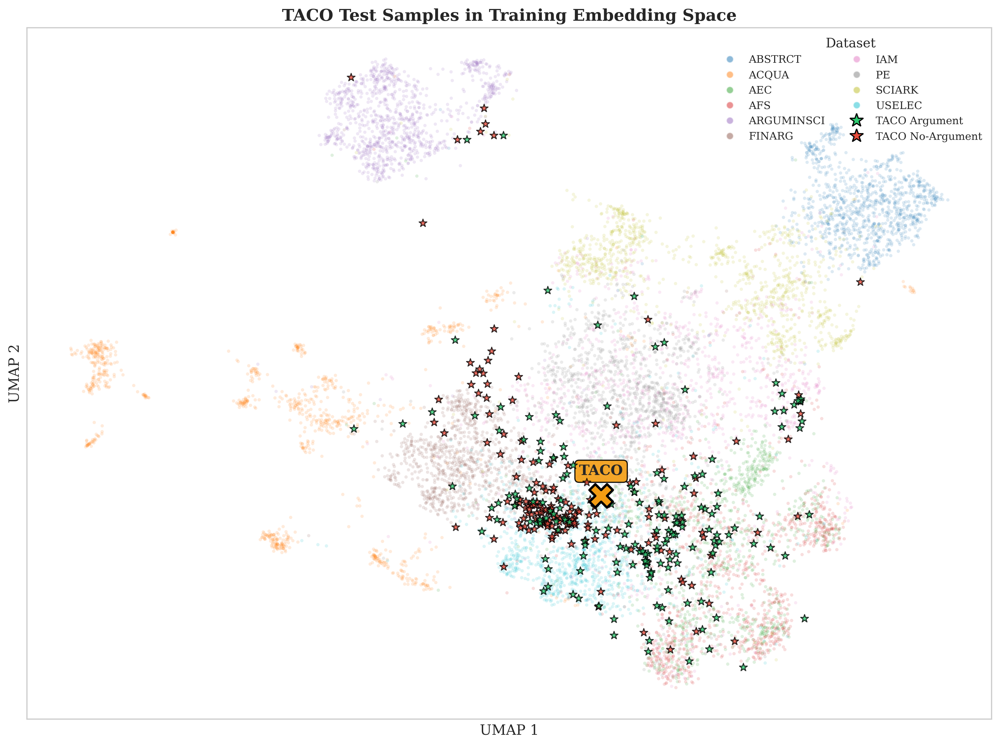

# Context-Awakens at Touché 2026

**1st Place — GAIC Shared Task @ Touché 2026** | Macro-F1: **0.7955**

This repository contains the code and data for our submission to the [Generalizable Argument Identification in Context (GAIC)](https://touche.webis.de/clef26/touche26-web/generalizable-argument-mining.html) shared task at Touché @ CLEF 2026.

## Overview

Argument identification models typically learn dataset-specific shortcuts rather than argumentative structure, leading to poor cross-dataset generalization. We approach GAIC by keeping model parameters fixed and moving dataset-specific information into the prompt: argument definitions, annotation guidelines, and document context. Our zero-shot system reaches 0.7955 macro-F1 on the Main evaluation and ranks first among submitted systems.

> **Paper:** [Context-Awakens at Touché: Generalizable Argument Identification with In-Context Learning](working_notes_touche.pdf) (CLEF 2026 Working Notes)

## Results

Official held-out test set scores ([full leaderboard](https://touche.webis.de/clef26/touche26-web/generalizable-argument-mining.html#leaderboard)):

| Team                | System                | TACO       | TAPE       | TAUS       | Main       |
| ------------------- | --------------------- | ---------- | ---------- | ---------- | ---------- |
| **context-awakens** | **Full GAIC Testset** | **0.8408** | 0.7604     | **0.7853** | **0.7955** |
| arginvariant        | arginvariant_1        | 0.8133     | **0.7757** | 0.7612     | 0.7834     |
| arginvariant        | arinvariant_2         | 0.8133     | **0.7757** | 0.7598     | 0.7829     |
| the-wildcards       | hybrid                | 0.8265     | 0.7465     | 0.7735     | 0.7822     |
| the-wildcards       | local                 | 0.7912     | 0.7506     | 0.7660     | 0.7693     |
| arginvariant        | arginvariant_3        | 0.8101     | 0.7204     | 0.7377     | 0.7561     |
| code-doctors        | run_1                 | 0.6025     | 0.6748     | 0.6734     | 0.6502     |
| the-wildcards       | solo                  | 0.5098     | 0.6216     | 0.6499     | 0.5938     |

The Main score averages TACO, TAPE, and TAUS — three annotation schemes applied to the same 340 sentences. A system must condition on the annotation rule, not just sentence surface.



*UMAP projection of TACO test samples overlaid on the 10 GAIC training datasets. The TACO centroid lies in the central region with overlap across debate and mixed-domain datasets — surface similarity alone cannot solve this evaluation.*

## Approach

### Context Ladder

We stack context sources cumulatively:

| Level | Prompt Content         | Coverage       |
| ----- | ---------------------- | -------------- |
| C0    | Generic instruction    | 10/10 datasets |
| C1    | + Argument definition  | 10/10 datasets |
| C2    | + Annotation guideline | 4/10 datasets  |
| C3    | + Document context     | 4/10 datasets  |

Adding the dataset-specific definition (C0→C1) provides the largest gain: +0.10 to +0.15 macro-F1 across models.

### Models

| Model              | Size    | Provider   |
| ------------------ | ------- | ---------- |
| Ministral 8B       | 8B      | Mistral AI |
| Mistral Medium 3.1 | unknown | Mistral AI |
| GPT-5.2            | unknown | OpenAI     |

### Dynamic Context Strategy

For submission, each sample receives the maximum available context for its dataset. Context is extracted automatically from dataset papers and guideline documents using GPT-5.2 with Pydantic schemas.

## Quick Start

```bash
git clone https://github.com/wideraHannes/GAIC-Thesis.git
cd GAIC-Thesis

# Install dependencies (requires uv: https://github.com/astral-sh/uv)
uv sync

# Run submission inference
uv run gaic/submission_inference.py --config config/submission/gpt5.2_dynamic.toml
```

## Reproduction

### Prerequisites

- Python 3.13+
- [uv](https://github.com/astral-sh/uv) package manager
- API access: OpenAI or Mistral AI

### Environment Setup

```bash
cp .env.example .env
# Add API keys:
# OPENAI_API_KEY=...
# MISTRAL_API_KEY=...
# PORTKEY_API_KEY=... (optional, for Azure gateway)

uv sync
```

### Running Experiments

```bash
# Submission inference (test set)
uv run gaic/submission_inference.py --config config/submission/gpt5.2_dynamic.toml

# Development experiments
uv run gaic/unified_experiment.py config/experiments/v3/gpt_5_2_openai/c1.toml

# Context extraction from PDFs
uv run gaic/preprocessing/extract_context.py

# Data contamination audit
uv run gaic/contamination_test.py
```

## Configuration

Experiments are fully parameterized via TOML:

```toml
[llm]
provider = "openai"
model = "gpt-5.2-2025-12-11"
temperature = 0.0

[submission]
context_strategy = "dynamic"  # c0, c1, c2 or dynamic
input_file = "test.jsonl"
output_dir = "submissions/gpt5.2_test"
```

See `config/experiments/` for experiment configurations with context ladder and manipulation settings.

## Datasets

10 benchmark datasets from GAIC (~17k sentences):

| Dataset    | Domain                    | Guidelines | Doc Context |
| ---------- | ------------------------- | ---------- | ----------- |
| ABSTRCT    | Biomedical abstracts      | Yes        | Yes         |
| ARGUMINSCI | Scientific papers         | Yes        | Yes         |
| PE         | Persuasive essays         | Yes        | Yes         |
| USELEC     | US election debates       | Yes        | Yes         |
| FINARG     | Financial text            | —          | Yes         |
| SCIARK     | Scientific articles       | —          | Yes         |
| ACQUA      | Argument quality          | —          | —           |
| AEC        | Argument efficacy         | —          | —           |
| AFS        | Argument facet similarity | —          | —           |
| IAM        | Internet argument mining  | —          | —           |

## References

- Feger, M., Boland, K., & Dietze, S. (2025). [Limited generalizability in argument mining: State-of-the-art models learn datasets, not arguments](https://aclanthology.org/2025.acl-long.1280/). ACL 2025.
- Kiesel, J. et al. (2026). [Overview of Touché 2026 — Argumentation Systems](https://touche.webis.de/clef26/touche26-web/). CLEF 2026.

## Other Projects

- [SHAP-In-NLP](https://github.com/wideraHannes/SHAP-In-NLP) — Explainability methods for NLP models using SHAP (Bachelor thesis)
- [attention-is-all-you-need-pytorch](https://github.com/wideraHannes/attention-is-all-you-need-pytorch) — PyTorch implementation of the Transformer architecture
- [VAE](https://github.com/wideraHannes/VAE) — Variational Autoencoder implementation
- [microscopic-image-cvae](https://github.com/floriankark/microscopic-image-cvae) — Conditional VAE for microscopic image generation

## Acknowledgments

- Heinrich Heine University Düsseldorf
- codecentric AG

## License

MIT
