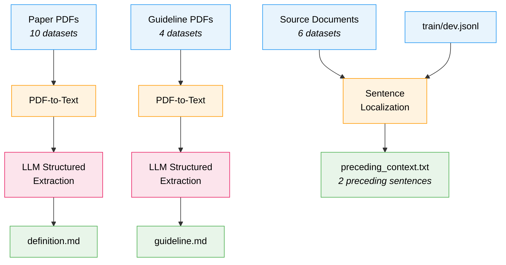
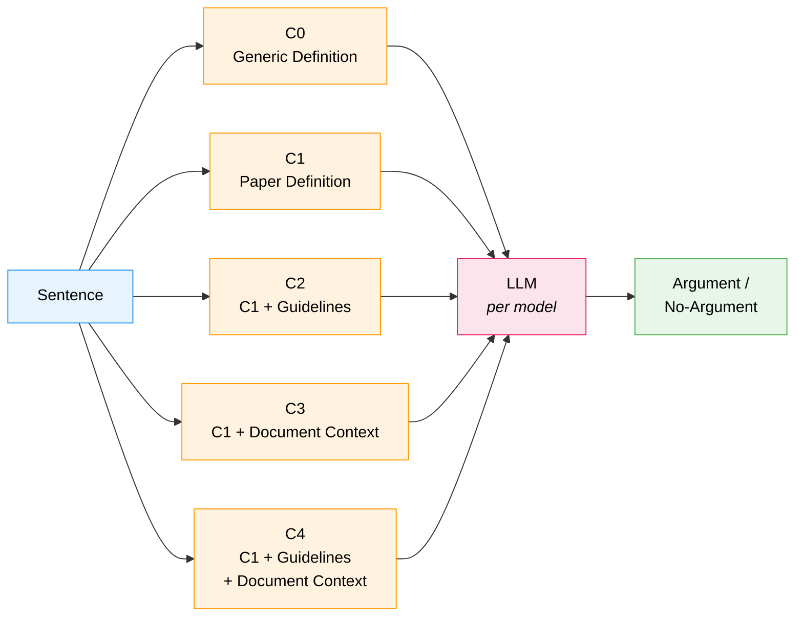

## 5. Methodology

### Preprocessing: Context Extraction

Before running any experiments, structured context must be extracted from the raw materials GAIC provides (paper PDFs, annotation guideline PDFs, source documents). This preprocessing produces the per-dataset context files that Parts 1–3 consume.

**Argument definition extraction.** Each of the 10 GAIC datasets links to the original paper that introduced it. Using PDF-to-text extraction (Kreuzberg), the paper text is passed to a language model with a structured output schema that synthesizes a 3–10 sentence definition of what constitutes an argument in that dataset and what does not. The prompt explicitly excludes dataset logistics, collection methodology, and experimental results — only the conceptual definition is retained. This replaces the generic, one-size-fits-all argument definition used in prior work with a definition grounded in each dataset's own theoretical framing.

**Annotation guideline extraction.** Four datasets (ABSTRCT, ARGUMINSCI, PE, USELEC) ship with annotation guideline PDFs. These are extracted analogously: the guideline text is passed to a language model that synthesizes the decision rules an annotator would apply to classify a sentence as Argument or No-Argument, including examples where available. The remaining six datasets receive a "Not available" placeholder.

**Document context extraction.** Six datasets (ABSTRCT, ARGUMINSCI, FINARG, PE, SCIARK, USELEC) provide source documents from which the labeled sentences were drawn. For each sample in these datasets, the two sentences immediately preceding the target sentence are extracted via punctuation-based sentence splitting and string matching against the source document. Each sample's preceding text is written to an individual file so it can be loaded per-sample at inference time. Datasets without source documents receive no document context.

**Output structure.** Preprocessing produces, for each dataset, a `definition.md`, a `guideline.md` (or "Not available"), a `dataset.json` recording capabilities and metadata, and — for datasets with source documents — per-sample preceding-sentence files under `data/{ID}.txt`. All experiment code reads from these files; no context is constructed on the fly.

### Prompt Design

All experiments use the same two-message prompt structure:

- **System prompt.** Instructs the model to act as a dataset annotator, classify the input as "Argument" or "No-Argument", respond with exactly one label, and only classify as "Argument" if the sentence clearly matches the argument definition. The relevant context (definition, guideline, document context, depending on the experimental condition) is injected into the system prompt.
- **User prompt.** Contains only the target sentence.

This separation ensures the model receives task instructions and context in the system role and the classification input in the user role. The same prompt template is used across all models, conditions, and datasets; only the injected context block varies.

### Part 1: Zero-Shot Robustness Across Model Scales

**Question:** Do zero-shot LLMs rely on argument structure or superficial cues, and how does this vary with model scale?

**Setup:**

- Models: Five decoder-based LLMs spanning 7B to frontier scale:
  - Mistral-7B-Instruct-v0.2 (7B)
  - Llama-3.1-8B-Instruct (8B)
  - Mistral-Small-24B-Instruct (24B)
  - Llama-3.1-70B-Instruct (70B)
  - GPT-4.1 (frontier-scale, closed-weight)
- Data: All 10 GAIC datasets, balanced samples per dataset
- Prompt: Generic argument definition, no dataset-specific context

**Manipulations:**

| Condition    | Description                                                       |
| ------------ | ----------------------------------------------------------------- |
| M0: Original | Unmodified sentences                                              |
| M1: Feger    | Remove stop words, function words, discourse markers, punctuation |
| M2: Shuffle  | Randomly permute word order                                       |

**Metrics:**

- Macro F1 per dataset and model
- Δ_feger = F1(M0) − F1(M1) per model
- Δ_shuffle = F1(M0) − F1(M2) per model

**Comparison baseline:** Encoder results from Feger et al. (Δ ≤ 0.02)

**Output:** Evidence for whether zero-shot LLMs rely on argument structure (large Δ) or shortcuts (small Δ), and how this varies across model scales.

### Part 2: Context Utilization

**Question:** How does rich context information affect argument identification, and under what conditions does it help or hurt?

**Setup:**

- Models: All five models from Part 1 (Mistral-7B, Llama-8B, Mistral-24B, Llama-70B, GPT-4.1)
- Data: Four datasets with full context availability (ABSTRCT, ARGUMINSCI, PE, USELEC); remaining six datasets receive only definition-level context (C0/C1)
- Document context: Two sentences preceding the target, extracted during preprocessing

**Context conditions:**

| Condition | Context injected into system prompt                              |
| --------- | ---------------------------------------------------------------- |
| C0        | Generic argument definition                                      |
| C1        | Dataset-specific argument definition (from paper)                |
| C2        | C1 + dataset-specific annotation guidelines                      |
| C3        | C1 + document context (2 preceding sentences)                    |
| C4        | C1 + annotation guidelines + document context                    |

**Metrics:**

- Macro F1 per condition, model, and dataset
- Δ_context = F1(Cn) − F1(C0) per model-dataset pair
- Manipulation sensitivity (Δ_feger, Δ_shuffle) per context condition
- Analysis of model x dataset interaction effects

**Output:** A characterization of when and why context helps or hurts, and whether context changes the model's reliance on sentence-internal argument structure.

### Part 3: Fine-Tuning Effects

**Question:** Does fine-tuning produce the same shortcut learning patterns seen in encoders?

**Setup:**

- Model: Best-performing open-weight model from Part 1 + LoRA adapters
- Data: Full GAIC training set (all 10 datasets)
- Input: Same prompt structure as Parts 1–2 under the Full context condition (definition + guidelines + document context), injected into the system prompt

**Training conditions:**

| Condition  | Description                                       |
| ---------- | ------------------------------------------------- |
| Zero-shot  | No training (baseline from Part 1)                |
| Fine-tuned | LoRA training on GAIC with full available context |

**Evaluation:**

- F1 on standard test sets
- F1 on manipulated test sets (Feger manipulation)
- Δ = F1(original) − F1(manipulated)

**Key comparison:**

| Outcome              | Δ (fine-tuned) | Interpretation                          |
| -------------------- | -------------- | --------------------------------------- |
| Encoder-like         | ≤ 0.05         | Shortcut learning is training-dependent |
| Partial degradation  | 0.05–0.20      | Decoders partially resist shortcuts     |
| Robustness preserved | ≥ 0.20         | Decoders fundamentally differ           |

**Optional extension:** If fine-tuning significantly degrades Δ, time permitting, alternative training strategies will be explored (e.g., data augmentation with manipulated examples, early stopping).
