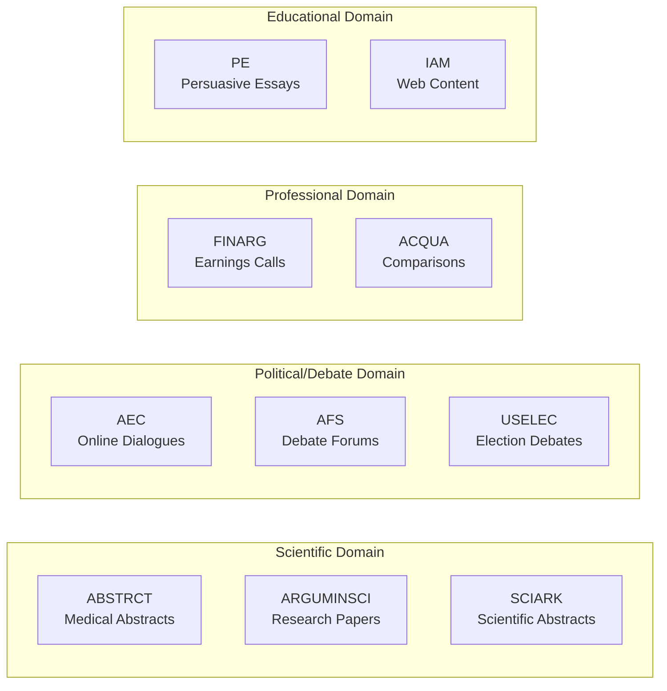
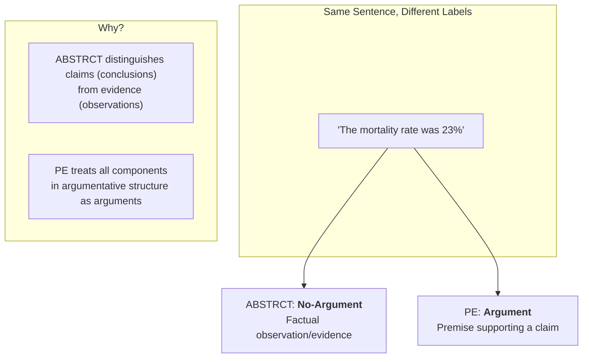

# The GAIC Shared Task

## 3.1 The Generalization Problem in Argument Mining

State-of-the-art argument mining systems consistently fail to generalize. Feger et al. (ACL 2025) demonstrated this through a comprehensive study across 17 benchmark datasets: BERT, RoBERTa, and DistilBERT achieve strong in-distribution performance (mean F1 = 0.79) but collapse on cross-dataset transfer (mean F1 = 0.56-0.61). The cause was revealed through controlled manipulation experiments—removing stop words, function words, and discourse markers produced negligible performance change (Δ ≤ 0.02). These models had learned to classify based on content words, exploiting topic and domain artifacts rather than the linguistic structures that define argumentation.

The paper concludes with a direct call to action:

> "Benchmarking should therefore build on combined datasets that capture the task's general demands... for which decoder-based argument mining may be of interest."

The GAIC shared task at Touché @ CLEF 2026, organized by the same research group, directly addresses this generalization failure.

## 3.2 Task Definition

GAIC reformulates argument identification as a context-grounded classification problem:

> "Given a sentence from a dataset along with metadata about its provenance, such as the source text and the dataset's annotation guidelines, predict whether the sentence can be annotated as an argument or not. Participants are encouraged to develop robust systems that generalize beyond lexical shortcuts and investigate ways to exploit rich context information for this purpose."

**Input:** A sentence + optional metadata (argument definition, annotation guidelines, document context)

**Output:** Binary label—"Argument" or "No-Argument"

**Evaluation:** Macro F1 across all datasets, ensuring balanced treatment of both classes

The key innovation is explicit: systems are provided rich context and expected to exploit it. This represents a paradigm shift from training-based generalization to context-grounded prompting.

## 3.3 The Benchmark: Ten Diverse Datasets

GAIC unifies 10 argument mining datasets spanning diverse domains, text genres, and argumentation frameworks.

| Dataset | Domain | Source | Samples | Argument Focus |
|---------|--------|--------|:-------:|----------------|
| ABSTRCT | Biomedical | RCT abstracts | 1,360 | Claims vs. evidence in clinical trials |
| ACQUA | Comparative | Web comparisons | 1,360 | Preference statements (better/worse) |
| AEC | Online debate | CreateDebate | 1,360 | Extractable argument facets |
| AFS | Debate forums | ProCon, iDebate | 1,360 | Self-contained debate positions |
| ARGUMINSCI | Scientific | Research papers | 1,360 | Own claims vs. background claims |
| FINARG | Financial | Earnings calls | 1,360 | Claims with premise support |
| IAM | Web | Mixed sources | 1,360 | Topic-dependent claims |
| PE | Educational | Persuasive essays | 1,360 | Major claims, claims, premises |
| SCIARK | Scientific | Abstracts | 1,360 | Claims and supporting evidence |
| USELEC | Political | Election debates | 1,360 | Policy stances and judgments |

**Total:** 13,600 sentences (10,200 train + 3,400 dev), balanced 50/50 between Argument and No-Argument.

This diversity is intentional: it forces systems to generalize rather than memorize dataset-specific patterns.

## 3.4 Context Availability

Not all context types are available for all datasets. This non-uniform availability creates a natural experimental design for studying which context types matter most.

| Dataset | Definition | Guidelines | Document Context |
|---------|:----------:|:----------:|:----------------:|
| ABSTRCT | ✓ | ✓ | ✓ |
| ARGUMINSCI | ✓ | ✓ | ✓ |
| PE | ✓ | ✓ | ✓ |
| USELEC | ✓ | ✓ | ✓ |
| FINARG | ✓ | — | ✓ |
| SCIARK | ✓ | — | ✓ |
| ACQUA | ✓ | — | — |
| AEC | ✓ | — | — |
| AFS | ✓ | — | — |
| IAM | ✓ | — | — |

**Summary:**
- **10/10** datasets have argument definitions (extracted from source papers)
- **4/10** datasets have annotation guidelines (ABSTRCT, ARGUMINSCI, PE, USELEC)
- **6/10** datasets have document context (preceding sentences from source documents)

### Context Types

**Argument Definitions** describe the theoretical framework for what constitutes an argument in each dataset. These are extracted from the original dataset papers and specify the conceptual criteria for classification.

**Annotation Guidelines** provide operational decision rules that annotators followed, including boundary cases, signal phrases, and concrete examples. When available, guidelines resolve ambiguities in the theoretical definition.

**Document Context** consists of the sentences immediately preceding the target sentence in the source document, enabling resolution of anaphora and understanding of local argumentative flow.

## 3.5 Annotation Scheme Heterogeneity

A critical observation: these datasets operationalize "argument" differently. The same sentence could be labeled "Argument" in one dataset and "No-Argument" in another, depending on the annotation scheme.

### Annotation Model Families

**Claim-Evidence Models** (ABSTRCT, SCIARK, IAM): Distinguish concluding statements from supporting observations. A statistical result is evidence (non-argumentative in some schemes) supporting a claim (argumentative).

**Hierarchical Models** (PE, ARGUMINSCI): Define nested structures—major claims supported by claims supported by premises. All components in the argumentative structure are labeled as arguments.

**Comparative/Stance Models** (ACQUA, USELEC): Require explicit preference direction or policy stance. Mere comparisons without expressed preference are non-argumentative.

**Extractability Models** (AEC, AFS): Focus on whether a sentence can stand alone as an interpretable argument without requiring extensive context.

This heterogeneity is precisely why context matters—models must adapt their classification criteria based on the provided definition and guidelines, not rely on universal lexical patterns.

## 3.6 The Context Engineering Opportunity

Traditional argument mining follows a training-based paradigm: collect labeled data, fine-tune an encoder, evaluate on held-out splits. This approach, as Feger et al. demonstrated, leads to shortcut learning—models memorize dataset-specific patterns rather than learning transferable argumentative reasoning.

GAIC proposes an alternative: **context-grounded classification**. Instead of encoding task knowledge into model weights through training, inject task knowledge into the prompt through rich context. This aligns with the broader 2026 paradigm of context engineering—replacing fine-tuning with carefully constructed prompts that guide model behavior.

The hypothesis underlying this thesis:

> Zero-shot LLMs, when provided with dataset-specific definitions and guidelines, can match or exceed trained encoders on cross-dataset argument identification—because context provides what training cannot: explicit, interpretable task specification that adapts to each dataset's notion of "argument."

The following chapter presents our methodology for testing this hypothesis.
