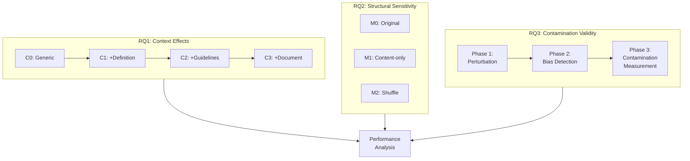
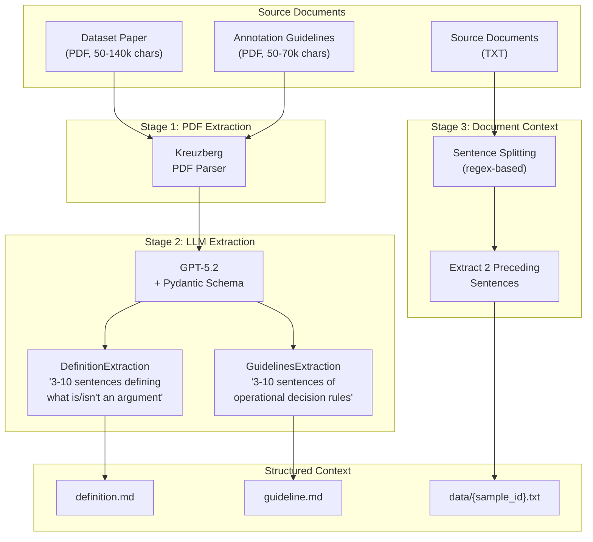
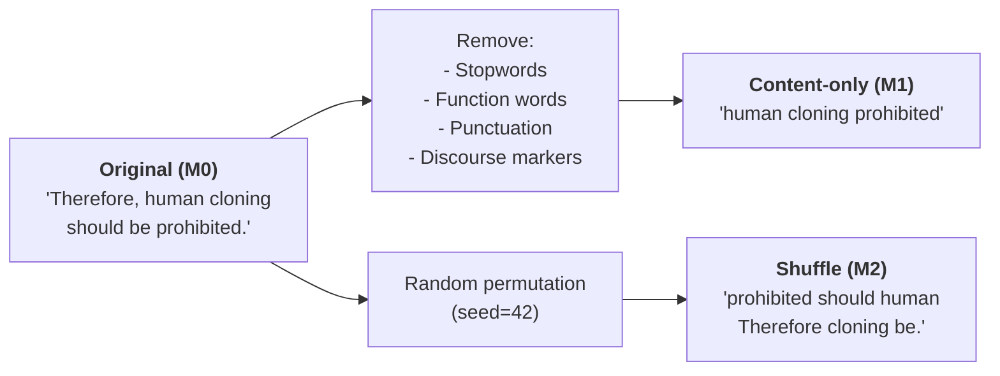
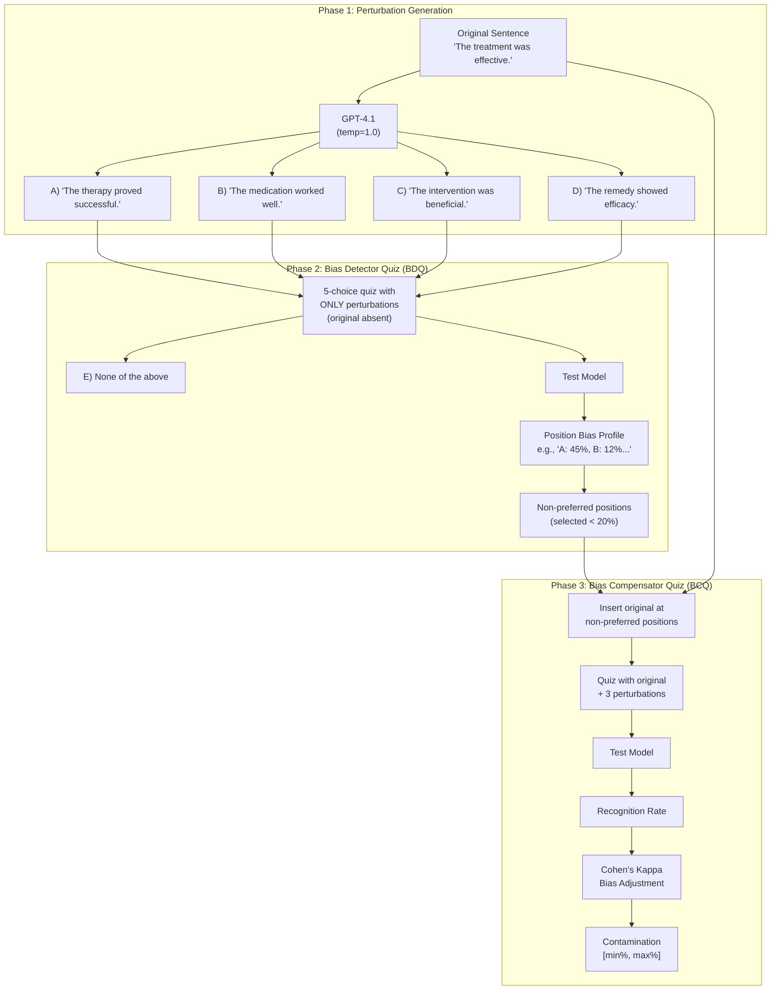

# Methodology

This chapter presents our experimental methodology for investigating whether zero-shot LLMs can solve the GAIC task through context exploitation. We address three research questions, each with a dedicated methodological approach.



## 4.1 Models

We evaluate decoder-based LLMs across multiple scales to test whether structural sensitivity and context exploitation vary with model capacity.

| Model | Parameters | Provider | Role |
|-------|------------|----------|------|
| Ministral 8B | 8B | Mistral | Small-scale baseline |
| Mistral Small | 24B | Mistral | Mid-scale (pilot model) |
| Mistral Medium | ~70B | Mistral | Large-scale Mistral |
| GPT-4.1 / GPT-5.2 | Frontier | OpenAI | Cross-provider validation |

All models are instruction-tuned (non-reasoning variants) for clean comparison with Feger et al.'s encoder experiments. Reasoning models are excluded because their chain-of-thought outputs confound classification analysis.

## 4.2 Context Extraction Pipeline (RQ1)

To exploit GAIC's rich metadata, we first transform raw PDF sources into structured, LLM-consumable context.



### Stage 1: PDF Extraction

Raw PDFs are converted to text using Kreuzberg, an open-source PDF parser that handles multi-column layouts, figures, and tables common in academic papers.

### Stage 2: Structured LLM Extraction

The extracted text is passed to GPT-5.2 with Pydantic schemas enforcing structured output:

```python
class DefinitionExtraction(BaseModel):
    definition: str = Field(
        description="3-10 sentences defining what an argument is and what it is not"
    )

class GuidelinesExtraction(BaseModel):
    guidelines: str = Field(
        description="3-10 sentences summarizing instructions for deciding "
                    "whether a sentence is an argument or not"
    )
```

The system prompt instructs extraction of dataset-specific criteria only—no generic argumentation theory, no dataset statistics, no methodological details.

### Stage 3: Document Context Extraction

For the 6 datasets with source documents, we extract the 2 sentences immediately preceding each target sentence using regex-based sentence splitting on `[.!?]` followed by an uppercase letter.

### The Context Ladder

Extracted context enables a cumulative ablation study:

| Level | Content Injected | What It Tests |
|-------|------------------|---------------|
| **C0** | Generic instruction only | Baseline LLM knowledge of "argument" |
| **C1** | + Dataset-specific definition | Does aligning to dataset theory help? |
| **C2** | + Annotation guidelines | Do operational rules add value beyond theory? |
| **C3** | + 2 preceding sentences | Does local discourse context help disambiguation? |

Each level includes all content from previous levels. C2 and C3 are only testable on datasets with the required context available.

## 4.3 Text Manipulation Experiments (RQ2)

To probe whether LLMs rely on argumentative structure or surface patterns, we apply systematic text manipulations following Feger et al.'s methodology.

| Condition | Transformation | Purpose |
|-----------|----------------|---------|
| **M0** | Original sentence | Baseline performance |
| **M1** | Content-only reduction | Test reliance on discourse markers, syntax |
| **M2** | Word shuffle | Test reliance on word order |



### M1: Content-Only Reduction

Implementation uses spaCy with the `en_core_web_sm` model:

**Removed elements:**
- Stopwords (spaCy default list, includes many discourse markers)
- Punctuation
- Function word POS tags: ADP (prepositions), AUX (auxiliaries), CCONJ/SCONJ (conjunctions), DET (determiners), PART (particles), PRON (pronouns), INTJ (interjections)

**Retained elements:** Content words (NOUN, VERB, ADJ, ADV, PROPN, NUM), lowercased

This manipulation tests whether models rely on discourse markers ("therefore," "however," "because") and syntactic scaffolding rather than semantic content.

### M2: Word Shuffle

All words are randomly permuted using a fixed seed (42) for reproducibility. Terminal punctuation is preserved but repositioned. This disrupts:
- Syntactic structure and grammatical relations
- Phrasal boundaries
- Word order patterns

Models that capture argumentative semantics independent of syntax should maintain performance; those relying on positional patterns will degrade.

### Delta Metrics

For each manipulation, we compute performance deltas relative to the original:

$$\Delta_{M1} = F1_{M0} - F1_{M1}$$
$$\Delta_{M2} = F1_{M0} - F1_{M2}$$

**Comparison baseline:** Feger et al. found encoder Δ ≤ 0.02—negligible sensitivity to manipulation. Our hypothesis: decoder LLMs will show substantially larger Δ due to their causal attention architecture, where word order is a hard constraint rather than a learned pattern.

## 4.4 Contamination Detection: The DCQ Method (RQ3)

Before interpreting RQ1/RQ2 results, we must address a validity threat: the 10 GAIC benchmark datasets were published between 2014-2022. LLM pre-training corpora likely include these sentences. If models achieve high F1 through memorization rather than classification, our findings are confounded.

We implement the Data Contamination Quiz (DCQ) methodology from Golchin & Surdeanu (TACL 2025), which detects contamination while controlling for position biases in multiple-choice responses.



### Phase 1: Perturbation Generation

For each dataset, we sample 50 sentences (25 Argument, 25 No-Argument) and generate 4 synonym-based perturbations per sentence using GPT-4.1 with temperature=1.0.

**Constraints enforced via Pydantic schema:**
- All 4 perturbations must differ from the original
- All 4 perturbations must differ from each other
- Only word-level substitutions (no structural changes)
- Meaning and structure must be preserved

### Phase 2: Bias Detector Quiz (BDQ)

Models often exhibit position biases in multiple-choice questions—preferring certain answer positions regardless of content. BDQ detects these biases before measuring contamination.

**Procedure:**
1. Present a 5-choice quiz using ONLY the 4 perturbations (original absent)
2. Option E: "None of the provided options"
3. Record which position the model selects
4. Aggregate across all samples

**Bias identification:** Positions selected less frequently than random chance (20% for 5 options) are marked as "non-preferred." If a model always avoids position A, we cannot trust contamination measurements at position A.

### Phase 3: Bias Compensator Quiz (BCQ)

BCQ measures contamination while compensating for detected biases.

**Procedure:**
1. For each non-preferred position, create a quiz with:
   - The original sentence at that position
   - 3 perturbations at other positions
   - Option E: "None of the above"
2. Record whether the model selects the original
3. Apply Cohen's Kappa adjustment:

$$\kappa = \frac{P_{observed} - P_{expected}}{1 - P_{expected}}$$

Where $P_{expected}$ is the bias rate from BDQ. This adjusts for cases where the model might accidentally select the original due to residual position preference rather than recognition.

**Output:** Contamination range [min%, max%] per model per dataset, accounting for measurement uncertainty across positions.

### Contamination Interpretation

| Range | Level | Interpretation |
|-------|-------|----------------|
| 0-20% | Low | Results valid |
| 20-40% | Moderate | Interpret with caution |
| 40%+ | High | Results potentially confounded |

### Connecting Contamination to RQ1/RQ2

Contamination testing serves as a validity check for our main findings:

**For RQ1 (Context Effects):** If a model shows high contamination on a dataset, improved F1 with context could reflect better memorization retrieval rather than genuine context exploitation. We flag such results for scrutiny.

**For RQ2 (Structural Sensitivity):** The critical test is whether manipulation sensitivity persists on contaminated data. If a model has memorized sentences but manipulation still causes large Δ, this suggests:
- Models are not doing verbatim retrieval
- They still process structure during generation
- Contamination inflates absolute F1 but does not eliminate structural sensitivity

This interpretation transforms contamination from a threat into additional evidence: persistent Δ on contaminated data strengthens the structural sensitivity finding.

## 4.5 Experimental Design

### Data Splits

| Split | Use | Samples per Dataset |
|-------|-----|---------------------|
| Dev | All RQ1/RQ2 experiments | ~340 (170 per class) |
| Test | Final evaluation, GAIC submission | Reserved |
| Train | Not used (zero-shot only) | — |

### Sample Sizes

- **Context/Manipulation experiments:** 30-60 samples per dataset (balanced), deterministic first-k sampling
- **Contamination testing:** 50 samples per dataset (25 per class)

### Reproducibility

- Fixed random seed: 42 for all stochastic operations
- Temperature: 0 for deterministic LLM outputs
- Structured outputs via Pydantic enforce valid labels
- Full configurations saved with each experiment result

### Prompt Structure

All experiments use a consistent two-message format:

**System prompt:**
```
You are an expert in argumentation analysis.

{assembled_context}

Classify whether the following sentence is an argument based on the criteria above.
Respond with exactly one word: "Argument" or "No-Argument".
```

**User prompt:**
```
{sentence}
```

Context is assembled in fixed order: definition → guideline → document context, with explicit section headers and a note that guidelines override definitions when they conflict.

## 4.6 Summary

| RQ | Method | Key Metric | Comparison Baseline |
|----|--------|------------|---------------------|
| RQ1 | Context ladder (C0→C3) | Macro F1 | Feger's trained encoders (0.63-0.74) |
| RQ2 | Text manipulation (M0/M1/M2) | Δ = F1(M0) - F1(Mx) | Feger's encoder Δ ≤ 0.02 |
| RQ3 | DCQ three-phase | Contamination [min%, max%] | Validity threshold: 40% |

This methodology enables systematic investigation of context engineering for argument identification while controlling for the contamination threat inherent in LLM benchmarking.
